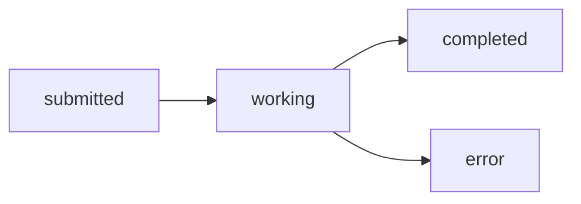

### Introduction to Google's A2A Protocol

Modern AI applications increasingly rely on **multi-agent systems**—collections of specialized bots collaborating to solve complex tasks. Yet today’s landscape is fragmented: every framework, cloud platform, or in‑house solution speaks its own “dialect,” forcing teams to build custom integrations that slow development and introduce brittle dependencies.

Enter Google’s Agent-to-Agent (A2A) Protocol, unveiled in April 2025. A2A defines a simple, HTTP‑based standard that lets any compliant AI agent exchange messages, negotiate actions, and share context—regardless of origin or vendor. Instead of wrestling with proprietary APIs, developers can treat agents as interchangeable microservices behind uniform REST endpoints.

Why does this matter? First, **interoperability** becomes plug‑and‑play: you could swap a third‑party vision agent for Google’s own Vision API or integrate a CrewAI planning agent into Vertex AI pipelines with just a few lines of configuration. Second, teams reclaim engineering hours spent on glue code, focusing instead on the higher‑level orchestration that drives real value. 

In the sections ahead, we’ll explore the nuts and bolts of the A2A Protocol, walk through a live Vertex AI + CrewAI demo, and assess the market implications of a truly open AI agent ecosystem. Strap in—Google’s A2A is about to redefine how intelligent services talk to each other.,### What is the A2A Protocol?

Google’s Agent-to-Agent (A2A) Protocol is an open‑source standard designed to enable seamless, framework‑agnostic communication between AI agents. Rather than locking you into a single vendor or library, A2A provides a common “language” and lifecycle model so that heterogeneous agents—built on TensorFlow, PyTorch, LangChain, or bespoke frameworks—can discover, exchange, and complete tasks together.

---

#### Purpose and High‑Level Overview

- **Vendor‑neutral interoperability**  
  A2A lets you plug in new agents without rewriting your messaging or orchestration layer.  
- **Declarative discovery**  
  Agents advertise capabilities via lightweight metadata (Agent Cards) so orchestrators can route tasks automatically.  
- **Standardized task management**  
  A shared set of task states (e.g., `submitted`, `working`, `completed`) helps monitoring dashboards, retries, and SLA enforcement.  
- **Composable messaging**  
  Agents exchange rich, structured payloads (Message Parts), enabling pipelines from retrieval to generation to evaluation.

---

#### Agent Cards

Agent Cards are JSON metadata files each agent publishes to signal its capabilities, version, and endpoints. Think of them as “business cards” for AI agents.

H4: Key Fields in an Agent Card
```json
{
  "agent_id": "openai-gpt4",
  "name": "GPT-4 Text Generator",
  "version": "1.0.0",
  "capabilities": [
    "text-generation",
    "summarization"
  ],
  "endpoint": "https://api.example.com/agents/gpt4",
  "input_schema": {
    "type": "object",
    "properties": {
      "prompt": { "type": "string" }
    }
  },
  "output_schema": {
    "type": "object",
    "properties": {
      "completion": { "type": "string" }
    }
  }
}
```
- `agent_id`: Unique identifier for routing.  
- `capabilities`: Tags used by orchestrators to match tasks.  
- `endpoint`: URL or gRPC address where the agent listens.  
- `input_schema`/`output_schema`: JSON Schema definitions for validation.

---

#### Task Lifecycle Management

A2A defines a simple, state‑machine‑style lifecycle for every “task” (a single unit of work):

1. **submitted**  
   The orchestrator posts a new task to an agent’s endpoint.  
2. **working**  
   The agent acknowledges and begins processing.  
3. **completed**  
   The agent returns the final result (success) or an error code (failure).

H4: Lifecycle Example

- Retries, timeouts, and SLA hooks can attach to transitions.  
- Centralized dashboards can subscribe to lifecycle events for observability.

---

#### Message Parts

Rather than free‑form text or binary blobs, A2A exchanges **Message Parts**—JSON objects that map exactly to the agent’s input/output schemas. This structured approach enables:

- **Validation** before sending  
- **Partial updates** (e.g., streaming tokens)  
- **Rich logging** for auditing

H4: Simple Message Part Example
```json
{
  "task_id": "1234",
  "message_part_index": 0,
  "content": {
    "prompt": "Summarize the following paragraph..."
  },
  "metadata": {
    "timestamp": "2024-06-15T12:34:56Z"
  }
}
```

---

#### From Simple Task Submission to Multi‑Agent Workflow

H4: 1. Basic “Hello, World” Task
1. Client submits a task:
   ```http
   POST /agents/openai-gpt4/tasks
   {
     "task_id": "task-0001",
     "message_part": {
       "content": { "prompt": "Hello world" }
     }
   }
   ```
2. Agent replies:
   ```json
   {
     "task_id": "task-0001",
     "state": "completed",
     "message_part": {
       "content": { "completion": "Hello world! 👋" }
     }
   }
   ```

H4: 2. Two‑Agent Pipeline
- **Agent A (Keyword Extractor)**  
  Reads a document, emits keywords.  
- **Agent B (Summary Generator)**  
  Consumes keywords to craft a concise summary.

Workflow:
1. Submit to Agent A: state → `working` → `completed` with `keywords`.  
2. Orchestrator packages keywords as a new message part for Agent B.  
3. Agent B processes, moves task → `completed` with `summary`.

H4: 3. Multi‑Agent Collaborative Workflow
Imagine an AI research assistant:
1. **Retrieval Agent**  
   Queries a vector database for relevant papers.  
2. **Extraction Agent**  
   Pulls out key findings, authors, and publication dates.  
3. **Analysis Agent**  
   Compares findings, rates novelty, flags contradictions.  
4. **Report Generator Agent**  
   Assembles a polished executive summary.

Each step:
- Submits a Message Part to the next agent.  
- Tracks a shared `task_conversation_id`.  
- Leverages Agent Cards to discover which agents can handle “retrieval”, “extraction”, etc.

---

By standardizing how agents advertise themselves (Agent Cards), manage task lifecycles, and exchange structured Message Parts, the A2A Protocol unlocks truly interoperable, scalable, and observable AI agent ecosystems—whether you’re running two steps or a dozen in concert.,### Comparing A2A to Anthropic’s MCP

When building AI pipelines you often need both structured context management and robust agent-to-agent coordination. Below is a comparative analysis of Google’s Agent‑to‑Agent (A2A) Protocol—designed for direct task delegation and execution—and Anthropic’s Model Context Protocol (MCP), which standardizes context sharing across models.

#### 1. Core Purpose & Design Philosophy

A2A Protocol  
- Focus: Task delegation, agent orchestration, and multi‑step workflows  
- Communication: Peer‑to‑peer messages over HTTP/2 or gRPC  
- Data Model: Structured tasks (`taskId`, `taskType`, dependencies, result payloads)  
- Extensibility: Dynamic agent discovery, custom task types  

MCP (Model Context Protocol)  
- Focus: Context enrichment and stateful prompt sharing across LLMs  
- Communication: Publish–subscribe of JSON‑LD context slots  
- Data Model: `@context`, `@type`, `ContextSlot` entries (e.g., conversation history, embeddings)  
- Extensibility: New context schemas, metadata tagging  

#### 2. Detailed Feature Comparison

| Feature                  | A2A Protocol                                          | Model Context Protocol (MCP)                         |
|--------------------------|-------------------------------------------------------|------------------------------------------------------|
| Primary Goal             | Agent task orchestration                              | Context exchange & LLM prompt management             |
| Message Format           | JSON `{ specVersion, type, taskId, parameters… }`      | JSON‑LD `{ @context, @type, contextId, slots… }`      |
| Communication Pattern    | Request–reply, pub‑sub events                         | Pub‑sub of context slots                             |
| Transport Layer          | Application + Transport (HTTP/2, gRPC)                | Application layer over HTTP/WebSocket                |
| Standardization Stage    | Draft proposal (Google IETF draft)                    | RFC draft (Anthropic contribution)                   |
| Typical API Methods      | `RegisterAgent`, `SendTask`, `ReportStatus`, `Cancel` | `ProvideContext`, `RequestContext`, `Acknowledge`    |
| Common Use Cases         | Multi‑agent workflows, dynamic pipelines              | Chat history sharing, summarization, embedding reuse |

#### 3. Example 1: Simple Context Sharing with MCP

A conversational assistant wants to pass a summarized chat history to a downstream LLM:

```json
{
  "specVersion": "mcp-1.0",
  "action": "ProvideContext",
  "payload": {
    "@context": "https://anthropic.com/mcp/v1",
    "@type": "ConversationHistory",
    "contextId": "chat-1234",
    "slots": [
      {
        "name": "messages",
        "contentType": "text",
        "data": [
          { "speaker": "user",      "text": "How’s the weather today?" },
          { "speaker": "assistant", "text": "It’s sunny, 75°F."        }
        ]
      },
      {
        "name": "summary",
        "contentType": "text",
        "data": "User asked about weather; assistant responded with current conditions."
      }
    ]
  }
}
```

A downstream model issues `RequestContext(contextId: "chat-1234")` to retrieve these slots and build a richer prompt without rehydrating the entire conversation.

#### 4. Example 2: Complex Task Delegation with A2A

A financial assistant coordinates three microservices—data fetcher, predictor, and report generator—via A2A:

```json
// 1. Coordinator → DataFetcher
{
  "specVersion": "a2a-1.0",
  "type": "TaskRequest",
  "taskId": "fetch-001",
  "taskType": "FetchFinancialData",
  "parameters": {
    "company": "ACME",
    "quarter": "Q1-2024"
  }
}

// 2. DataFetcher → Coordinator
{
  "specVersion": "a2a-1.0",
  "type": "TaskCompletion",
  "taskId": "fetch-001",
  "status": "success",
  "result": { "dataUri": "gs://acme/q1-2024.csv" }
}

// 3. Coordinator → ReportGenerator
{
  "specVersion": "a2a-1.0",
  "type": "TaskRequest",
  "taskId": "report-002",
  "dependencies": ["fetch-001"],
  "taskType": "GenerateReport",
  "parameters": {
    "dataUri": "gs://acme/q1-2024.csv",
    "template": "quarterly-summary"
  }
}
```

Each agent registers its capabilities up front and subscribes to relevant task types, allowing dynamic orchestration, error handling, and status updates.

#### 5. Choosing Between A2A and MCP

- Use MCP when your primary need is **rich context management**—sharing embeddings, conversation history, or metadata across LLM calls.  
- Use A2A when you require **end-to-end task orchestration**—delegating work, handling dependencies, and scaling multi-agent workflows.  

Often, the best architectures blend both: MCP ensures every model run has structured context, while A2A handles higher‑level coordination and execution.,### Impact on Building AI Agents

The A2A Protocol unlocks a paradigm shift for AI engineers: instead of locking into one vendor’s ecosystem or proprietary API, you can assemble—and reconfigure—agents from any A2A‑compliant provider. Below, we’ll walk from a simple single‑task interaction to a fully orchestrated multi‑agent pipeline, using CrewAI and pydanticAI as concrete examples.  

#### Reducing Vendor Lock‑In  
Traditional agent frameworks often force you into their messaging formats, SDKs, or transport layers. Once you’ve invested in “Vendor X,” swapping in “Vendor Y” means rewriting glue code, retraining teams, and revalidating security. A2A flips that script: agents speak the same “language” out of the box, so you can mix clients and servers from different ecosystems without extra adapters.  

Key benefits:  
- Standardized message envelope (headers, IDs, routing)  
- Schema‑driven payloads (JSON, Protobuf, or Pydantic models)  
- Pluggable transports (HTTP/REST, gRPC, AMQP)—all hidden behind the A2A wire format  

#### Seamless Interoperability  
With A2A, CrewAI’s orchestration library, pydanticAI’s schema enforcement, or your in‑house Python agents can handshake immediately. Let’s see it in action.

#### H4: 1. Single‑Task Validation with CrewAI & pydanticAI  
Imagine you’ve built a “pydantic-validator” agent that confirms records meet a set of rules. You want to call it from a CrewAI orchestrator without writing custom serializers.  

```python
# schemas.py (pydanticAI agent side)
from pydantic import BaseModel
from typing import Dict, List

class Record(BaseModel):
    id: int
    value: float

class ValidationRequest(BaseModel):
    record: Record
    rules: Dict[str, str]

class ValidationResponse(BaseModel):
    valid: bool
    errors: List[str]
```

```python
# orchestrator.py (CrewAI client side)
from crewai import A2AClient
from schemas import Record, ValidationRequest, ValidationResponse

# 1. Initialize a CrewAI client with your orchestrator ID
client = A2AClient(agent_id="validator-orchestrator")

# 2. Build a validation request
request = ValidationRequest(
    record=Record(id=42, value=85.5),
    rules={"value": ">=0"}
)

# 3. Send it to the pydantic-validator agent and await a typed response
response: ValidationResponse = client.send(
    recipient="pydantic-validator",
    payload=request
)

print(f"✅ Valid? {response.valid}, Errors: {response.errors}")
```

Under the hood, `client.send()` serializes the Pydantic model to JSON, wraps it in the A2A envelope, routes it over gRPC (or HTTP), and deserializes back into your `ValidationResponse`. No vendor‑specific boilerplate.

#### H4: 2. Orchestrating a Multi‑Agent Pipeline  
Single tasks are useful—but real workflows chain dozens of micro‑agents. Let’s extend our example to a three‑step pipeline:
1. Fetch raw data  
2. Validate each record  
3. Send an alert if any records fail  

```python
# pipeline.py
import asyncio
from crewai import A2AClient

client = A2AClient(agent_id="pipeline-orchestrator")

async def run_pipeline():
    # Step 1: Fetch raw data
    fetch_resp = await client.send(
        recipient="data-fetcher",
        payload={"query": "SELECT id, value FROM sales WHERE date=CURRENT_DATE"}
    )
    records = fetch_resp["records"]  # e.g., List[{"id":1,"value":100.0}, ...]

    # Step 2: Validate each record
    validations = []
    for rec in records:
        val = await client.send(
            recipient="pydantic-validator",
            payload={"record": rec, "rules": {"value": ">0"}}
        )
        validations.append(val)

    # Step 3: Alert on failures
    failures = [v for v in validations if not v["valid"]]
    if failures:
        alert_resp = await client.send(
            recipient="alert-agent",
            payload={"failures": failures}
        )
        print("🚨 Alerts sent:", alert_resp["status"])
    else:
        print("🎉 All records passed validation.")

if __name__ == "__main__":
    asyncio.run(run_pipeline())
```

Key takeaways:  
- A single `A2AClient` orchestrates multiple agent IDs.  
- Each call can use different payload schemas or transports.  
- You’re free to plug in new agents (e.g., a data‑cleaner, an enrichment service) without rewriting the orchestrator—just point to a new `recipient` and payload model.

#### Why This Matters for Your Team  
By adopting A2A:
- **Iterate faster:** Swap in prototype agents from different vendors to compare performance.  
- **Scale modularly:** Add, remove, or version agents in your pipeline independently.  
- **Future‑proof:** As more platforms embrace A2A, your codebase stays agnostic—lower maintenance, higher flexibility.  

With a standardized protocol at the core, building AI agents becomes less about wrestling SDK quirks and more about designing elegant, scalable workflows. Next, we’ll explore how this interoperability reshapes the AI agent marketplace and what it means for vendor competition.,### Market Implications and Google’s Strategy

As AI agents move from research labs into production workloads, the A2A Protocol isn’t just another API—it’s a market catalyst. In this section, we’ll unpack how Google is leveraging A2A via Vertex AI to cement its infrastructure leadership, highlight the protocol’s projected cost savings, and explore emergent business models—from agent marketplaces to drastically reduced integration overhead.

#### Google’s Strategic Play with Vertex AI Integration
By baking A2A support directly into Vertex AI, Google has positioned itself at the center of the next AI infrastructure battleground:
- **Seamless Orchestration**  
  Vertex AI pipelines can now invoke A2A‑compliant agents across clouds, on‑prem clusters, or edge devices with a single configuration. That means teams spend less time writing glue code and more time focusing on model logic.
- **Unified Authentication & Governance**  
  Leveraging Google Cloud’s IAM, logging, and VPC‑Service‑Controls, enterprises inherit enterprise‑grade security for every A2A handshake—no need to reinvent auth layers for each agent integration.
- **Network Effect of Ecosystem**  
  As more partners publish Vertex‑certified agents (e.g., specialized vision, finance, or IoT processors), Google becomes the de‑facto hub for discovery and billing—driving usage of Cloud Storage, BigQuery, and other adjacent services.

#### Projected Industry‐Wide Cost Savings
Analysts estimate that standardizing on the A2A Protocol could unlock roughly **$4 billion** in savings across development, integration, and maintenance by 2026. Early indicators from pilot programs include:
- 72% reduction in vendor lock‑in costs, as teams can swap agents without rewriting interfaces  
- 50% faster onboarding time for new AI services, thanks to uniform handshake and schema  
- 30–40% lower integration engineering hours, once custom adapters become a thing of the past  

Breakdown of Potential Savings per Agent (Annualized)  
- Adapter development & maintenance: $120K → $20K  
- Security & compliance audits: $80K → $25K  
- Operational runbooks & on‑call: $100K → $40K  

#### The Rise of Agent Marketplaces
Just as npm, PyPI, and Docker Hub democratized code reuse, A2A Protocol spawns **agent marketplaces**—centralized catalogs where any developer can:
1. **Discover** agents by capability tags (e.g., “OCR,” “fraud detection,” “dialog management”).  
2. **Evaluate** standardized metadata (versioning, input/output schemas, SLAs).  
3. **Compose** multi‐agent workflows without custom bindings.

Example: A boutique analytics shop uploads a “social‑listening” agent to Google’s AI Hub. Within hours, a marketing startup discovers, self‑tests, and bills usage via their existing Cloud contract—no SDK downloads, zero lock‑in.

#### Dramatically Reduced Integration Overhead
Before A2A:
- Each new agent → custom REST wrappers, schema translators, auth adapters.  
- Average “hello world” to production: 4–6 weeks.  
- Cumulative maintenance debt across 10+ agents: 3–4 FTEs.

With A2A Protocol:
```bash
# Vertex AI: Discover and connect to a translation agent
gcloud ai agents list --filter="capability:translation" --region=us-central1
gcloud ai agents connect translation-agent-01 \
  --handshake-schema=./handshake.json \
  --auth-token=$A2A_TOKEN
```
- Agents integrate in days, not weeks.  
- Lock‑in index down by 72%.  
- FTEs reallocated from “integration plumbing” to feature development.

#### Market Scenarios in Action

##### H4: Small‑Scale Agent Service Discovery  
Imagine a two‑person startup building a niche customer‑support chatbot. Instead of training a custom intent‑recognizer, they:
1. Browse an A2A marketplace for a “FAQ intent extraction” agent.  
2. Spin up a 30‑day trial via Vertex AI in under an hour.  
3. Pipe user queries through the agent and receive standardized JSON responses.  

Outcome: They shave **70%** off initial dev time and can focus on UX and domain training.

##### H4: Large‑Scale Enterprise Adoption  
A global retailer wants to integrate inventory forecasting, dynamic pricing, and supply‐chain anomaly detection—each provided by different vendors. With A2A:
- They define a central “workflow orchestrator” agent within Vertex AI.  
- The orchestrator invokes vendor‑provided agents (across AWS, GCP, on‑prem) via A2A handshakes.  
- Standardized telemetry aggregates logs and metrics into BigQuery for real‐time dashboards.  

Result:  
- Time to deploy multi‐agent pipelines drops from 6 months to 2 months.  
- Vendor portability ensures they can swap out underperforming agents mid‑holiday season.  
- Governance teams manage SLAs in a unified console, reducing audit times by 60%.

#### Looking Ahead: A New Business Landscape
The A2A Protocol isn’t just a technical standard—it’s a foundation for new business models:
- **Subscription‐based agent networks:** Developers pay per‑transaction or per‑session, with built‑in billing via Google Cloud’s metering.  
- **Specialized vertical marketplaces:** Finance, healthcare, and manufacturing sectors curate vetted, compliance‑ready agents.  
- **Community‑driven innovation:** Open‑source agents gain traction faster, backed by a universal integration layer.

By anchoring A2A in Vertex AI, Google is staking a claim as the **operating system** for agent ecosystems—driving down costs, accelerating innovation, and reshaping how software is composed in the AI era. Next, we’ll dive into best practices for designing your first A2A‑compliant agent, ensuring you capitalize on this new infrastructure paradigm.,### Conclusion: The Future of AI Collaboration with A2A

As AI systems grow more complex and distributed, seamless agent-to-agent communication becomes critical. Google’s A2A Protocol addresses this need head‑on by offering:

- **A Unified Standard**  
  Establishes a common message format and operation lexicon, so disparate agents—whether built in Python, Node.js, or Rust—speak the same language.  
- **Plug‑and‑Play Interoperability**  
  Decouples business logic from transport and serialization, enabling teams to swap in new models, services, or infrastructures with minimal friction.  
- **Extensibility for Every Use Case**  
  Supports custom extensions without breaking core guarantees, from autonomous data pipelines to multi‑agent orchestration in robotics or fintech.  
- **Enterprise‑Grade Reliability**  
  Leverages proven patterns for authentication, error handling, and back‑pressure, so production workloads stay robust at scale.  

Together, these capabilities pave the way for a future where AI agents collaborate as predictably as microservices do today—accelerating innovation, reducing integration costs, and unlocking new classes of composite applications.

Ready to get hands‑on?  
1. Explore the A2A Protocol documentation on GitHub:  
   https://github.com/google/a2a  
2. Share your questions, experiments, or integration stories in the comments below—your feedback helps shape the standard.  

Want to stay at the cutting edge of AI collaboration? Join the Digital Cognition Club to dive deeper into A2A, learn about emerging protocols, and connect with practitioners pushing the boundaries of autonomous systems:  
https://cognition.digital  

Let’s build the future of interconnected AI—together.